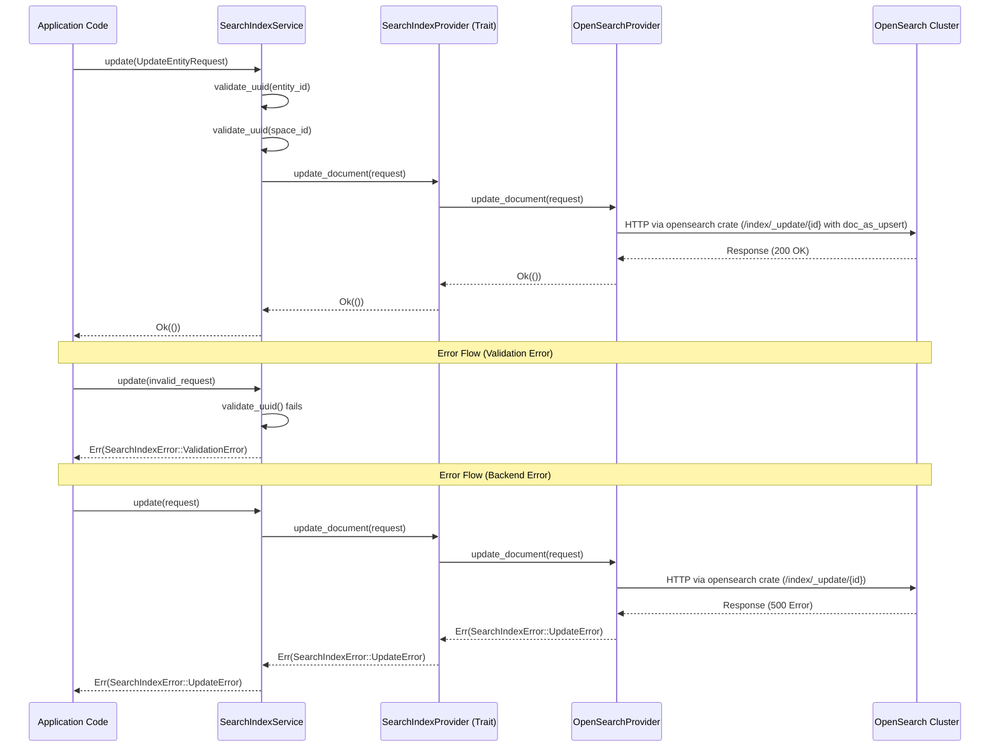

# Search Indexer Repository Architecture

## Sequence Diagram



## Layered Overview

```
┌─────────────────────────────────────────────────────────────────┐
│                        Application Code                         │
│  - Uses SearchIndexService for all operations                   │
│  - Handles SearchIndexError                                     │
└────────────────────────────┬────────────────────────────────────┘
                             │
                             ▼
┌─────────────────────────────────────────────────────────────────┐
│                    SearchIndexService                           │
│  - Validates input (UUIDs, batch sizes)                         │
│  - Converts requests to EntityDocument                          │
│  - Delegates operations to SearchIndexProvider                  │
│  - Returns SearchIndexError                                     │
└────────────────────────────┬────────────────────────────────────┘
                             │
                             ▼
┌─────────────────────────────────────────────────────────────────┐
│                SearchIndexProvider (Trait)                      │
│  - Abstract backend interface                                   │
│  - Methods: update_document (upsert), delete_document          │
│    + bulk_update, bulk_delete                                  │
│  - Returns SearchIndexError                                     │
└────────────────────────────┬────────────────────────────────────┘
                             │
                             │ Implementation
                             ▼
┌─────────────────────────────────────────────────────────────────┐
│                  OpenSearchProvider                             │
│  - Implements SearchIndexProvider                               │
│  - Makes calls to an OpenSearch cluster using the opensearch    │
│    Rust crate for all REST calls                                │
│  - Handles index configuration and OpenSearch-specific logic    │
│  - Converts errors from opensearch crate to SearchIndexError    │
└────────────────────────────┬────────────────────────────────────┘
                             │
                             ▼
┌─────────────────────────────────────────────────────────────────┐
│                   OpenSearch Cluster                            │
│  - OpenSearch server                                            │
│  - Stores and indexes documents                                 │
│  - Returns HTTP responses                                       │
└─────────────────────────────────────────────────────────────────┘
```

## Component Responsibilities

### SearchIndexService
- **Input validation**: UUID format, required fields, batch size limits
- **Request handling**: UpdateEntityRequest (upsert: creates or updates)
- **Error handling**: All errors are SearchIndexError
- **Configuration**: Batch size limits, etc.

### SearchIndexProvider (Trait)
- **Abstract interface**: Defines contract for all backend implementations
- **Operation methods**: CRUD and bulk operations
- **Error type**: Returns SearchIndexError for all operations

### OpenSearchProvider
- **Implements SearchIndexProvider**: Concrete backend implementation
- **HTTP communication**: All calls to OpenSearch cluster are performed using the [opensearch Rust crate](https://docs.rs/opensearch/)
- **Error conversion**: Translates OpenSearch errors into SearchIndexError
- **Index management**: Handles index creation, aliases, etc.

## Error Flow

All errors propagate as `SearchIndexError` through each layer:

```
OpenSearch Cluster Error
    ↓
OpenSearchProvider (converts to SearchIndexError)
    ↓
SearchIndexProvider (passes through)
    ↓
SearchIndexService (passes through)
    ↓
Application Code (handles SearchIndexError)
```

## Example Data Flow: Updating/Creating a Document

```
1. Application: update(UpdateEntityRequest { entity_id: "123", ... })
   ↓
2. SearchIndexService: Validates UUIDs
   ↓
3. SearchIndexProvider: update_document(&UpdateEntityRequest)
   ↓
4. OpenSearchProvider: Makes HTTP update request with doc_as_upsert=true
   ↓
5. OpenSearch: Creates document if missing, updates if exists, returns 200 OK
   ↓
6. Response flows back: Ok(()) → Application
```

